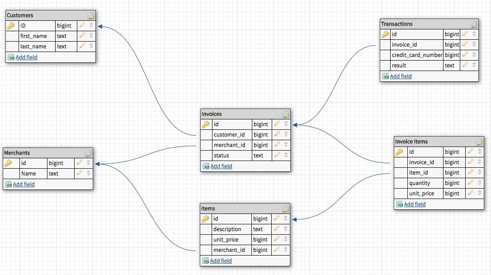

### README

# Rales Engine

### See The Active Site:
[Heroku Rales Engine Customers](https://enigmatic-badlands-29046.herokuapp.com/api/v1/customers) <br>
[Heroku Rales Engine Invoice Items](https://enigmatic-badlands-29046.herokuapp.com/api/v1/invoice_items) <br>
[Heroku Rales Engine Invoices](https://enigmatic-badlands-29046.herokuapp.com/api/v1/invoices) <br>
[Heroku Rales Engine Items](https://enigmatic-badlands-29046.herokuapp.com/api/v1/items) <br>
[Heroku Rales Engine Merchants](https://enigmatic-badlands-29046.herokuapp.com/api/v1/merchants) <br>
[Heroku Rales Engine Transactions](https://enigmatic-badlands-29046.herokuapp.com/api/v1/transactions) <br>

This project was designed to push our boundaries building out an API to serve Etsy style JSON data from a business analytics type application. It was built using a spec harness with some additional functionality thought to be practical.

For Information on the SPEC HARNESS, please visit:<br>
[Turing School Rales Engine Spec Harness](https://github.com/turingschool/rales_engine_spec_harness)

For Information on the Technical Specifications for the Project:<br>
[Turing School Rales Engine Project](http://backend.turing.io/module3/projects/rails_engine)

### Table Of Contents
- [Versions/Prerequisites](#versions-prerequisites)
- [Setup](#setup)
- [Database](#database)
- [The Test Suite](#the-test-suite)
- [Spinning Up A Server](#spinning-up-a-server)
- [Authors](#authors)

### Versions/Prerequisites
---
##### Main:
To Install and run this application please be aware of the following versions and requirements:
- Postgresql 10+
- Rails 5+
- Ruby 2.4+

###### Secondary:
- ActiveRecord
- ActiveModelSerializers
- PG
- Puma

### Setup
---
- First clone down this repository and change directory into the project directory:
```
git clone https://github.com/anon0mys/rales_engine.git
cd rales_engine
```
- Then in your command line run bundle to install the gem dependencies:
```
bundle
```
- Now setup your database and run the migrations to properly set up your database tables:
```
rake db:create
rake db:migrate
```
- It's now time to seed the database with the supplied Etsy-like data:
```
rake db:seed:all
```
- At this point the project is set up. From here you have several options.

<br>

### Database
---
An understanding of how the database is setup is crucial to understand the relationships between the component tables of the projects. Please see the following illustration of the Rales Engine Schema:

<br>

### The Test Suite
---

#### Test Information

##### Test Suite Components:
- DatabaseCleaner
- FactoryBot
- Rspec
- ShouldaMatchers

#### Test Documentation and Tweaks

- For additional documentation and the individual tests as the suite runs:
```
--format=documentation
```
- Additional Useful Flags:
```
--order=random
--color
```

##### About The Tests:
 The test suite includes test for the following:
- Model Level Testing<br>
These tests can be found in the following folder:
```
spec/models/
```
- Request Testing<br>
These tests can be found in the following folders:
```
spec/api/v1/requests/customers
spec/api/v1/requests/invoice_items
spec/api/v1/requests/invoices
spec/api/v1/requests/items
spec/api/v1/requests/merchants
spec/api/v1/requests/transactions
```
These test test the following categories of endpoints: Model, Relationship, and Business Intelligence.

##### Running The Suite:
- In order to run the test suite, from the root project folder simply run:
```
rspec
```

- In order to run a specific test file, add the path to the rspec command, an example follows:
```
rspec spec/requests/api/v1/invoices/invoices_spec.rb
```

<br>

### Spinning Up a Server
---

#### To Visit Specific Endpoints:
- For a breakdown of how the endpoints are structured, please visit this documentation here:<br>
[Endpoint Explanation](https://github.com/anon0mys/rales_engine/blob/master/endpoint.md)

- Next spin up your server:
```
rails s
```
<br>

##### Visit any of the endpoints in the endpoint documentation: [Endpoint Explanation](https://github.com/anon0mys/rales_engine/blob/master/endpoint.md)<br>
An example would be:
- Model:
```
http://localhost:3000/api/v1/invoices
http://localhost:3000/api/v1/invoices/88
```
- Relationship:
```
http://localhost:3000/api/v1/customers/1/invoices
```
- Business Intelligence:
```
http://localhost:3000//api/v1/merchants/most_items?quantity=5
```

<br>

### Authors
- [Evan Wheeler](https://github.com/anon0mys)
- [Tyler Lundgren](https://github.com/nergdnvlt)
